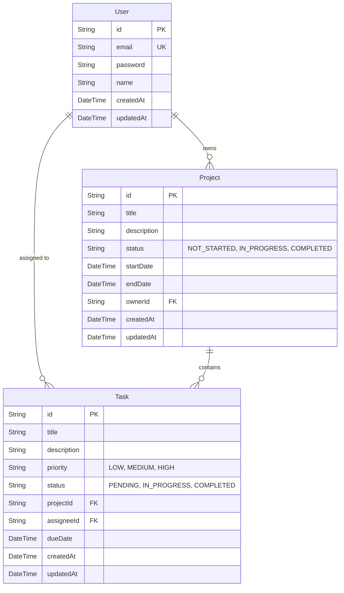

# NEXUS Database Schema

This database uses Prisma ORM mapped to an SQLite database.

## ER Diagram (Mermaid)

## Tables

### 1. User
Stores authentication and profile information.
- `id` (String, UUID) - Primary Key
- `email` (String, Unique)
- `password` (String, Hashed)
- `name` (String)

### 2. Project
High-level container for tasks.
- `id` (String, UUID) - Primary Key
- `title` (String)
- `description` (String, Optional)
- `status` (Enum: NOT_STARTED, IN_PROGRESS, COMPLETED)
- `startDate` (DateTime, Optional)
- `endDate` (DateTime, Optional)
- `ownerId` (String, UUID) - Foreign Key to User

### 3. Task
Actionable items within a project.
- `id` (String, UUID) - Primary Key
- `title` (String)
- `description` (String, Optional)
- `priority` (Enum: LOW, MEDIUM, HIGH)
- `status` (Enum: PENDING, IN_PROGRESS, COMPLETED)
- `projectId` (String, UUID) - Foreign Key to Project
- `assigneeId` (String, UUID) - Foreign Key to User
- `dueDate` (DateTime, Optional)
